# SmartQuiz Jr. 
SmartQuiz Jr. is an interactive quiz application designed for children to make learning fun and engaging. It features a variety of topics, colorful graphics, and rewarding feedback to keep young learners motivated.

Data Flow Diagram Level - 0(Overall System Overview)

```mermaid
flowchart TD
    U[👦 User - Child] -->|Quiz Request / Answers| SQJ[🧠 SmartQuiz Jr System]
    SQJ -->|AI-Generated Questions| U
    SQJ -->|Store & Retrieve Data| DB[(📦 MongoDB Database)]
    SQJ -->|Uses AI Models & Speech APIs| AI[🤖 AI & External APIs]
    U -->|Voice / Text Feedback| SQJ
```

Data Flow Diagram Level - 1
(Major Modules of SmartQuiz Jr)

DFD Level - 2 (Internal Data flow)
